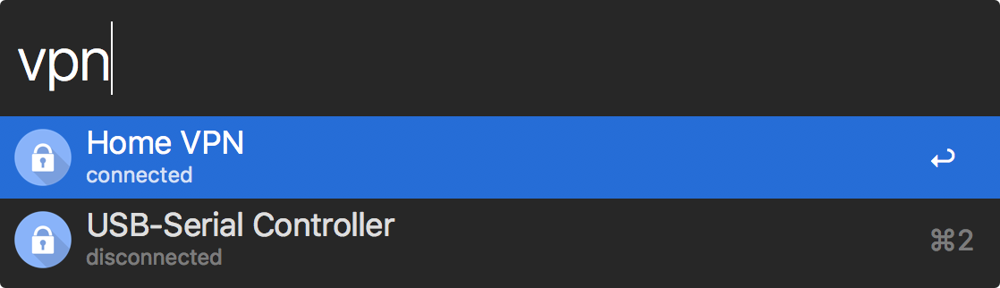

# vpn-control

Alfred Workflow to control VPN connections

## Install

Download and open [VPN-Control Workflow](https://github.com/therivenman/vpn-control/raw/master/VPN-Control.alfredworkflow)

*Requires Alfred [Powerpack](https://www.alfredapp.com/powerpack/).*

## Usage

Type `vpn` into Alfred to present you with a list of all your available VPN connections.  Connectivity status is shown for each connection.  Upon selection the workflow will attempt to connect/disconnect to the VPN depending on it's current state.

## License

MIT Licence.  See [LICENSE](https://github.com/therivenman/vpn-control/blob/master/LICENSE) for more details.
